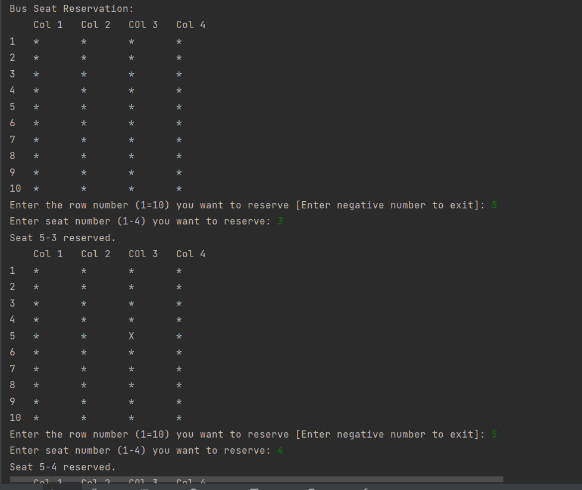

<p align="center">
  
</p>

<h1 align="center">SeatReservation</h1>

<p align="center">
  <a href="#project-description">Project Description</a> • 
  <a href="#features">Features</a> • 
  <a href="#tech-stack">Tech Stack</a> • 
  <a href="#installation">Installation</a> • 
  <a href="#usage">Usage</a>
</p>

<p align="center">
  

</p>

---

## Project Description

**SeatReservation** is a Java console application created as a **university lab exercise**.  
It allows users to reserve seats in a simple text-based interface, helping practice Java fundamentals like arrays, loops, and input handling.  

---

## Features

- Reserve a seat by number  
- Prevents duplicate reservations  
- Displays available vs. reserved seats  
- Simple text-based interface  

---

## Tech Stack

- **Language**: Java  
- **IDE**: IntelliJ IDEA (or any Java IDE)  

---

## Installation

```bash
git clone https://github.com/nca-gabriel/SeatReservation.git
cd SeatReservation
``` 
---

## Usage
Compile & Run via CLI:
cd src
java Main.java
java Main

Run via IntelliJ IDEA:

Open the project in IntelliJ IDEA

Right-click Main.java → Run 'Main.main()'
